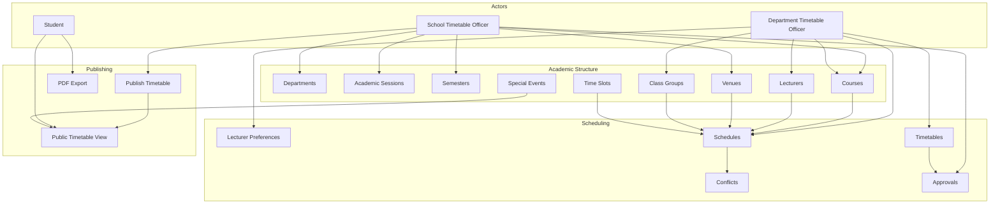
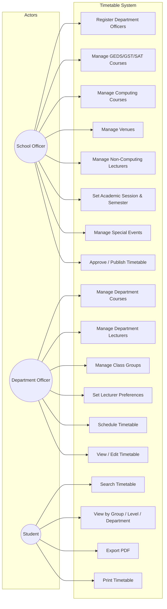
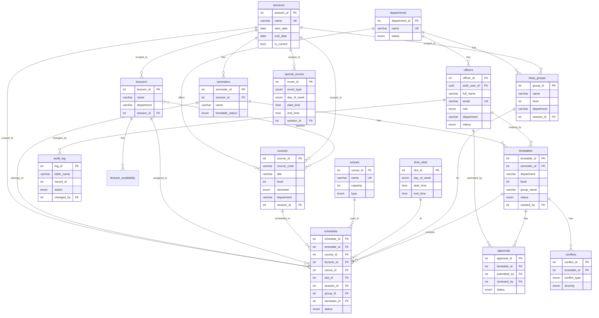
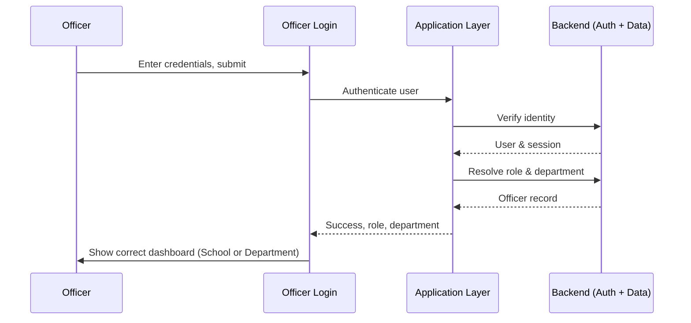
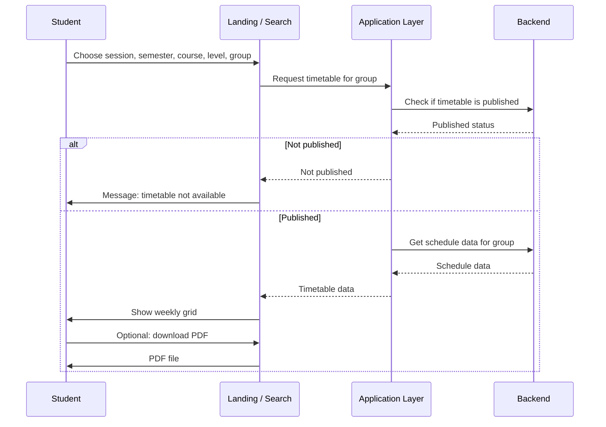
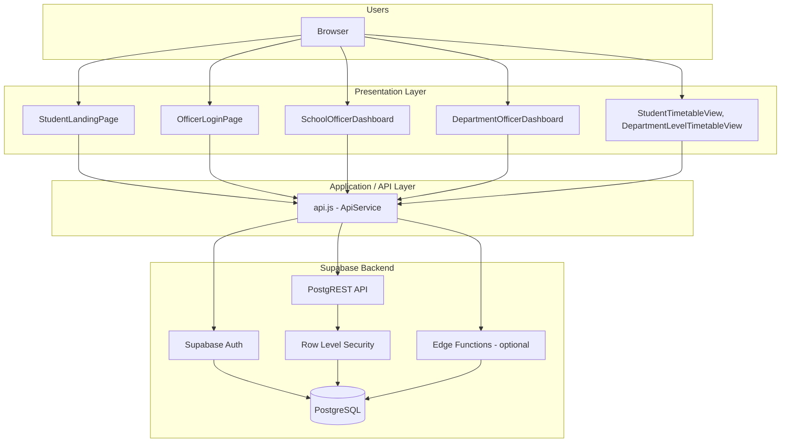

# School of Computing Timetable System — Diagrams & Implementation

This document provides conceptual and technical diagrams plus a detailed implementation description, aligned with the project docs (README, QUICK_REFERENCE, QUICK_START, TROUBLESHOOTING, SUPABASE_SETUP_GUIDE).

**How to use this doc:**  
- **Sections 1–4.5 (diagrams)** describe the system at a high level: concepts, structure, flows, and who talks to whom. They are **deliberately separate from** the full business logic.  
- **Section 8 (logic, constraints, heuristics)** holds the detailed rules, validations, and behaviour. Use the diagrams to explain structure and flow; use Section 8 when explaining or screenshotting actual logic and constraints.

---

## 1. Conceptual Diagram

The system is a **computer-aided timetable generation and management system** for the School of Computing. At a high level, three actor types interact with core concepts: **Academic Structure**, **Scheduling**, and **Publishing**.



**Summary:** School Officers own academic structure and approval; Department Officers build courses, lecturers, class groups, and schedules; Students consume published timetables and export PDFs. Schedules link courses, lecturers, venues, class groups, and time slots under session/semester and respect special events (e.g. chapel, break).

---

## 2. Functional Decomposition Diagram

Top-level functions are broken into sub-functions per role and domain.

```mermaid
flowchart TD
    Root[Timetable System]

    Root --> Auth[Authentication]
    Root --> School[School Officer Functions]
    Root --> Dept[Department Officer Functions]
    Root --> Public[Public / Student Functions]

    Auth --> Login[Login]
    Auth --> Logout[Logout]
    Auth --> Register[Register Officer]

    School --> RegOfficers[Register Department Officers]
    School --> GEDS[Manage GEDS/GST/SAT Courses]
    School --> Computing[Manage Computing Courses]
    School --> Venues[Manage Venues]
    School --> NonCompLect[Manage Non-Computing Lecturers]
    School --> ClassGroupsSchool[Manage Class Groups - School]
    School --> AcadSettings[Academic Settings: Session, Semester]
    School --> SpecialEvents[Special Events: Chapel, Break]
    School --> Approve[Approve / Publish Timetables]

    RegOfficers --> CRUD_Officers[CRUD Officers]
    GEDS --> CRUD_GEDS[CRUD GEDS Courses]
    Computing --> CRUD_Comp[CRUD Computing Courses]
    Venues --> CRUD_Venues[CRUD Venues]
    NonCompLect --> CRUD_Lect[CRUD Non-Computing Lecturers]
    AcadSettings --> SetSession[Set Current Session]
    AcadSettings --> SetSemester[Set Semesters]
    SpecialEvents --> CRUD_Events[CRUD Special Events]

    Dept --> DeptCourses[Department Courses]
    Dept --> DeptLecturers[Department Lecturers]
    Dept --> DeptClassGroups[Class Groups]
    Dept --> LecturerPrefs[Lecturer Preferences]
    Dept --> ScheduleTimetable[Schedule Timetable]
    Dept --> ViewTimetable[View Timetable]

    DeptCourses --> CRUD_DeptCourses[CRUD Department Courses]
    DeptLecturers --> CRUD_DeptLect[CRUD Department Lecturers]
    DeptClassGroups --> CRUD_ClassGroups[CRUD Class Groups]
    LecturerPrefs --> CRUD_Prefs[CRUD Availability Slots]
    ScheduleTimetable --> Generate[Generate / Manual Schedule]
    ScheduleTimetable --> ConflictCheck[Conflict Detection]
    ScheduleTimetable --> Submit[Submit for Approval]

    Public --> Search[Search Timetable]
    Public --> ViewByGroup[View by Course / Level / Group]
    Public --> ViewByDept[View by Department]
    Public --> ViewByLevel[View by Level]
    Public --> ExportPDF[Export PDF]
    Public --> Print[Print]
```



---

## 3. Use Case Diagram

Actors: **Student**, **School Timetable Officer (STTO)**, **Department Timetable Officer (DTTO)**. System boundary: Timetable System.



**Include/extend (conceptual):**  
- “View Timetable” includes “Search Timetable” (session, semester, course, level, group).  
- “Schedule Timetable” extends “Conflict Detection” (lecturer, venue, group double-booking).  
- “Export PDF” and “Print” extend “View Timetable”.

---

## 4. Entity-Relationship Diagram

Entities and relationships derived from `supabase/migrations/20260221000001_complete_schema.sql` and related migrations.



---

## 4.5 Sequence Diagrams

These diagrams show **who interacts with whom** and the **order of interactions** at a high level. They are **deliberately separate from the system’s detailed logic**: validation rules, conflict checks, and business rules are documented in **Section 8**, not in these flows. Use the diagrams for “what happens in what order”; use Section 8 for “what rules and constraints apply.”

### 4.5.1 Officer Login



### 4.5.2 Student Views Timetable (by Group)



### 4.5.3 Department Officer Adds a Schedule Entry

```mermaid
sequenceDiagram
    participant Officer
    participant UI as Schedule Screen
    participant App as Application Layer
    participant Backend as Backend

    Officer->>UI: Enter course, lecturer, class, venue, time
    UI->>UI: Local checks (e.g. required fields)
    UI->>App: Submit schedule entry
    App->>App: Apply business rules & validations
    alt Validation fails
        App-->>UI: Error message
        UI->>Officer: Show error
    else Validation passes
        App->>Backend: Persist schedule
        Backend-->>App: Saved
        App-->>UI: Success
        UI->>Officer: Confirm; refresh list
    end
```

### 4.5.4 Student Views Department or Level Timetable

```mermaid
sequenceDiagram
    participant User
    participant UI as Landing / Search
    participant App as Application Layer
    participant Backend as Backend

    User->>UI: View by department (or level)
    UI->>App: Request department/level timetable
    App->>Backend: Check published; fetch schedules
    Backend-->>App: Data or not published
    alt Not published
        App-->>UI: Not available
        UI->>User: Message
    else Available
        App-->>UI: All levels & groups for department
        UI->>User: Single-page timetable grid
    end
```

---

## 5. Relational Model

Tables with primary keys (PK), unique constraints (UK), and foreign keys (FK). Based on the same schema and migrations.

| Table | Primary Key | Unique / Business Keys | Foreign Keys |
|-------|-------------|------------------------|--------------|
| **departments** | department_id | name | — |
| **officers** | officer_id | auth_user_id, email | auth.users(id) |
| **sessions** | session_id | name, is_current (one true) | — |
| **semesters** | semester_id | (session_id, name) | session_id → sessions |
| **lecturers** | lecturer_id | idx_lecturers_name_department_session | session_id → sessions |
| **lecturer_availability** | availability_id | (lecturer_id, day_of_week, start_time, end_time) | lecturer_id → lecturers |
| **courses** | course_id | (course_code, session_id) | session_id → sessions |
| **venues** | venue_id | name | — |
| **class_groups** | group_id | (name, department, session_id, level) | session_id → sessions |
| **time_slots** | slot_id | (day_of_week, start_time, end_time) | — |
| **special_events** | event_id | — | session_id → sessions |
| **timetables** | timetable_id | — | semester_id → semesters, created_by → officers, approved_by → officers |
| **schedules** | schedule_id | (lecturer_id, slot_id, session_id) WHERE status='scheduled' | timetable_id, course_id, lecturer_id, venue_id, slot_id, session_id, group_id, semester_id |
| | | (venue_id, slot_id, session_id [, semester_id]) WHERE status='scheduled' | |
| | | (group_id, slot_id, session_id) WHERE status='scheduled' | |
| **approvals** | approval_id | — | timetable_id, submitted_by, reviewed_by → officers |
| **conflicts** | conflict_id | — | timetable_id, resolved_by → officers |
| **audit_log** | log_id | — | changed_by → officers |
| **system_settings** | setting_id | setting_key | updated_by → officers |

\* Unique on lecturers may be name+department+session per migration/constraints.

**Critical constraints (conflict prevention):**  
- One lecturer per (slot_id, session_id) for scheduled rows.  
- One venue per (slot_id, session_id [, semester_id]) for scheduled rows (semester-scoped where applicable).  
- One class group per (slot_id, session_id) for scheduled rows.

---

## 6. Architectural Diagram

The system fits a **layered + BFF-style** architecture: React SPA (presentation + client logic), single API service layer (BFF) talking to Supabase (data + auth).



**Layers:**  
- **Presentation:** React components (dashboards, landing, timetable views, PDF export).  
- **Application:** Single `api.js` module (auth, CRUD, conflict checks, public timetable, audit).  
- **Backend:** Supabase (Auth, PostgREST, RLS, PostgreSQL; optional Edge Functions for validation/schedule creation).

---

## 7. Detailed Implementation: Modules, Rules & Constraints

This section describes how each module works and how rules and constraints interact, using the **docs** (README, QUICK_REFERENCE, QUICK_START, TROUBLESHOOTING, SUPABASE_SETUP_GUIDE) and the codebase.

### 7.1 Entry Points & Roles

- **App.tsx** maintains view state (`student` | `officer-login` | `officer-dashboard`) and user identity (email, role, department) in `localStorage` / `sessionStorage`.  
- **Student:** `StudentLandingPage` → search → `StudentTimetableView` or department/level views.  
- **Officer:** `OfficerLoginPage` → Supabase Auth + `officers` lookup → `SchoolOfficerDashboard` (role `school-officer`) or `DepartmentOfficerDashboard` (role `department-officer`, department from `officers.department`).

Ref: README (role-based dashboards), QUICK_REFERENCE (login credentials and navigation).

### 7.2 School Officer Module

- **Dashboard:** Overview stats (departments, lecturers, courses, schedules), recent activity from `audit_log`, quick links to all management views.  
- **Register Officers:** CRUD on `officers` (full_name, email, department, role, password via Auth). Constraints: unique email; department officers restricted to their department in RLS.  
- **GEDS/GST/SAT Courses:** CRUD on `courses` with category GEDS/SAT; optional assignment (e.g. class_group_id, lecturer, slot) for non-computing courses shown on student timetable.  
- **Computing Courses:** CRUD on `courses` (category Core/Elective, department, level, semester). Unique (course_code, session_id).  
- **Venue Management:** CRUD on `venues` (name, capacity, type, building). Unique name.  
- **Non-Computing Lecturers:** CRUD on `lecturers` (non-computing dept); used for GEDS/SAT assignment.  
- **Academic Settings:** Current session and semesters (sessions, semesters). One current session (`is_current`), semesters per session; semester can be First, Second, Summer, Post-SIWES (see TROUBLESHOOTING for enum).  
- **Special Events:** CRUD on `special_events` (chapel, lunch/break, seminar; day, time, session). Used in public timetable to show BREAK (e.g. 1–2 PM) and chapel.  
- **Approval/Publish:** Semesters have `timetable_status` (e.g. approved, published). Only when a semester is published do public timetable APIs return data; otherwise they return `published: false`.

Ref: QUICK_REFERENCE (School Officer checklist, navigation, workflows).

### 7.3 Department Officer Module

- **Department Courses:** CRUD on department-scoped `courses` (computing); level, semester (First/Second/Both/Summer/Post-SIWES).  
- **Department Lecturers:** CRUD on `lecturers` for that department; linked to courses they teach.  
- **Class Groups:** CRUD on `class_groups` (name, level, department, session_id). Unique (name, department, session_id); 400 level often A/B only.  
- **Lecturer Preferences:** CRUD on `lecturer_availability` (day, start_time, end_time, preference_level). Used to guide or validate scheduling.  
- **Schedule Timetable:**  
  - Create/update/delete rows in `schedules`. Each row: course_id, lecturer_id, venue_id, slot_id, session_id, group_id, optional semester_id, optional created_by_role.  
  - **Conflict checks (api.js):**  
    - **Lecturer:** same lecturer, same slot, same session → not allowed (unique index).  
    - **Venue:** same venue, same slot, same session; when semester_id is used, only schedules in that semester or “concurrent” semesters (e.g. Summer + Post-SIWES) block (see `_getConcurrentSemesterIds`, `checkVenueConflict`).  
    - **Group:** same class group, same slot, same session → not allowed (unique index).  
  - Schedules can be created by department officer (created_by_role) and filtered in department view so officers see only their own schedule entries where applicable.  
- **View Timetable:** Department officer sees schedules for their department (and optionally only those they created), in a grid by level/group.

Ref: QUICK_REFERENCE (Department Officer checklist, workflows), QUICK_START (17 tables, conflict logic).

### 7.4 Public / Student Module

- **Search:** Session, semester, course (department), level, group.  
- **By group:** `getPublicTimetable(classGroupId, sessionId)` — only runs if at least one semester for that session has `timetable_status = 'published'`. Returns schedules for that class group plus GEDS/SAT assignments for that group (from `courses.assignment`).  
- **By department:** `getPublicTimetableByDepartment(sessionId, departmentName)` — all levels and groups for the department; used for “department timetable” (one page, one grid).  
- **By level:** Same API as department; client filters by level for “level timetable.”  
- **Display:** Monday–Friday, 7 AM–6 PM; 1–2 PM shown as BREAK (fixed rule). Special events (chapel, etc.) can override or label slots.  
- **PDF / Print:** Client-side (e.g. jsPDF) from the same data; branding (School of Computing, BUCC) per README design system.

Ref: README (student features), QUICK_REFERENCE (student features, view by group/department/level).

### 7.5 Data & Integrity Rules

- **Sessions/Semesters:** Schedules and courses are scoped by session_id; semesters group timetables. Semester status and timetable_status control visibility and conflict scope.  
- **Uniques:** Enforced in DB (see Relational Model): lecturer-slot-session, venue-slot-session (with semester where applicable), group-slot-session.  
- **Concurrent semesters:** Summer and Post-SIWES share the same venue pool for conflict checks; First/Second are separate. Implemented in `_getConcurrentSemesterIds` and venue conflict logic.  
- **Friendly errors:** api.js maps duplicate/unique and foreign-key errors to user-facing messages (TROUBLESHOOTING: 409 duplicate, 400 enum, 403 audit_log).

Ref: TROUBLESHOOTING (duplicate key, enum, RLS), QUICK_START (tables, business logic).

### 7.6 Security (RLS)

- **School officer:** Full CRUD on departments, officers, sessions, semesters, venues, courses (GEDS/SAT and computing), lecturers, class groups, special events, timetables, approvals; read audit_log.  
- **Department officer:** Read all departments; CRUD limited to own department for courses, lecturers, class groups, schedules, preferences; read sessions, semesters, time_slots, venues; department-scoped filters in API.  
- **Public:** No auth for public timetable; PostgREST/RLS expose only what is needed for public read (e.g. public_read_* policies in migrations).

Ref: QUICK_START (RLS), comprehensive_rls_policies migration.

### 7.7 How It All Fits Together

1. **School Officer** sets up sessions, semesters, venues, GEDS/SAT and computing courses, non-computing lecturers, special events, and department officers.  
2. **Department Officer** adds department courses, lecturers, class groups, and preferences, then builds schedules. The API and DB enforce no double-booking of lecturer, venue, or group per slot/session (and per semester for venues where applicable).  
3. When **School Officer** publishes a semester, **Students** (and public) can search and view timetables by group, level, or department; 1–2 PM is always BREAK; special events appear where configured.  
4. **Audit log** records key actions (e.g. schedule insert/update/delete) for dashboard “recent activity”; RLS may block audit insert for some roles (TROUBLESHOOTING).  
5. **Conflict detection** is implemented in the API (and optionally in Edge Functions); the relational model’s unique indexes are the final guarantee against conflicting schedules.

Ref: README (overview, features), QUICK_REFERENCE (workflows, navigation), QUICK_START (what runs where), TROUBLESHOOTING (errors and fixes), SUPABASE_SETUP_GUIDE (deployment and environment).

---

## 8. All Logic, Constraints & Heuristics (Screenshot-Ready)

This section lists **every** business rule, validation, constraint, and heuristic so you can pair screenshots of code with a single place to explain them.

### 8.1 Database Constraints (Enforced by PostgreSQL)

| Constraint | Where | Purpose |
|------------|--------|--------|
| **Unique: lecturer per slot per session** | `schedules`: `idx_unique_lecturer_slot` (lecturer_id, slot_id, session_id) WHERE status='scheduled' | One lecturer cannot be in two places at the same time. |
| **Unique: venue per slot per session (with semester)** | `schedules`: `idx_unique_venue_slot_semester` (venue_id, slot_id, session_id, semester_id) WHERE status='scheduled' AND semester_id IS NOT NULL | Same room not double-booked in the same semester (or concurrent semesters use same pool). |
| **Unique: venue per slot (legacy, no semester)** | `schedules`: `idx_unique_venue_slot_legacy` (venue_id, slot_id, session_id) WHERE status='scheduled' AND semester_id IS NULL | Legacy rows without semester still block the venue for the whole session. |
| **Unique: class group per slot per session** | `schedules`: `idx_unique_group_slot` (group_id, slot_id, session_id) WHERE status='scheduled' | One class cannot have two lectures at the same time. |
| **Unique: department name** | `departments`: name UNIQUE | No duplicate department names. |
| **Unique: officer email** | `officers`: email UNIQUE | One account per email. |
| **Unique: session name** | `sessions`: name UNIQUE | No duplicate session names. |
| **Unique: at most one current session** | `sessions`: idx_sessions_current_unique WHERE is_current = TRUE | Only one session can be "current". |
| **Unique: semester name per session** | `semesters`: (session_id, name) UNIQUE | e.g. one "First" per session. |
| **Unique: lecturer name per department per session** | `lecturers`: idx_lecturers_name_department_session | No duplicate full name in same department and session. |
| **Unique: officer full name per department** | `officers`: idx_officers_fullname_department | No duplicate full name in same department. |
| **Unique: course code per session** | `courses`: (course_code, session_id) UNIQUE | Same course code once per session. |
| **Unique: venue name** | `venues`: name UNIQUE | No duplicate venue names. |
| **Unique: class group (name, department, session, level)** | `class_groups`: idx_class_groups_unique (name, department, session_id, level) | Same group name allowed for different levels (e.g. 300 A and 400 A). |
| **Unique: time slot (day, start, end)** | `time_slots`: (day_of_week, start_time, end_time) UNIQUE | No duplicate slot definition. |
| **Unique: lecturer availability (lecturer, day, start, end)** | `lecturer_availability`: (lecturer_id, day_of_week, start_time, end_time) UNIQUE | No duplicate preference slot. |

**Code reference:** `supabase/migrations/20260221000001_complete_schema.sql`, `20260304000001_class_groups_unique_include_level.sql`, `20260312000001_schedules_semester_id.sql`, `20260230000001_unique_lecturer_officer_names.sql`.

---

### 8.2 Schedule Conflict Checks (API Layer)

All return `{ success, conflict, message }` or `{ success, overLimit, message }`. Used before insert/update and in UI validation.

| Check | Function | File:Logic | Rule |
|-------|----------|------------|------|
| **Venue conflict** | `checkVenueConflict(sessionId, venueId, day, startTime, endTime, excludeScheduleId, semesterId)` | `api.js`: overlap in time (s1 < e2 && e1 > s2); same venue, same day. When `semesterId` set, only schedules in that semester or **concurrent semesters** (Summer + Post-SIWES) block. | Venue cannot be used by two classes at the same time; semester-scoped so ended semesters free the room. |
| **Lecturer conflict** | `checkLecturerTimeConflict(sessionId, lecturerId, day, startTime, endTime, excludeScheduleId)` | `api.js`: same lecturer, same day, overlapping time. No semester filter (lecturer is session-wide). | Lecturer cannot teach two classes at the same time. |
| **Class group conflict** | `checkClassGroupTimeConflict(sessionId, groupId, day, startTime, endTime, excludeScheduleId, courseId)` | `api.js`: (1) Computing schedules for that group at overlapping time; (2) **Elective exception:** if both existing and new course are `Elective`, overlap is allowed (students choose one). Existing row uses `row.course_category` (from joined `courses.category` in getSchedulesWithDetails; mapped result should expose `course_category` for this). New course uses fetch by `courseId`. (3) GEDS/SAT assignments for that group (from `courses.assignment`) also block overlapping time. | Class cannot have two courses at same time, except two Electives; non-computing assignments count. |
| **Class day limits** | `checkClassDayLimits(sessionId, groupId, day, startTime, endTime, excludeScheduleId, semesterId)` | `api.js`: For that class on that day: (1) **Total hours** (schedules + GEDS/SAT for that group) after merging overlapping/adjacent intervals must be ≤ 6 hours. (2) **No stretch** (single merged block) &gt; 3 hours. Uses `_getConcurrentSemesterIds` when `semesterId` set so Summer/Post-SIWES share the same pool. | Per class per day: max 6 h total; max 3 h in any continuous block (e.g. 7–9 and 9–10 = 3 h; adding 10–11 would be 4 h stretch → conflict). |
| **Special event conflict** | `checkSpecialEventConflict(sessionId, day, startTime, endTime, classGroupLevel)` | `api.js`: Break (event_type = 'lunch'): applies **all days**; any overlap → conflict. Chapel/seminar: `day_of_week` = 'All' or matches day; level from `description` (e.g. "Level 300") must match `classGroupLevel` or be null (all levels). | No class during break or during chapel for that level. |
| **Course hours limit** | `checkCourseHoursForGroup(sessionId, courseId, classGroupId, durationHours, excludeScheduleId, semesterId)` | `api.js`: **Post-SIWES:** max 6 hours per (course, group). **Summer:** max 2 hours per (course, group). **First/Second:** max = course `credit_units` (default 2). Sum only schedules in that semester; exclude current row when editing. | Prevents over-scheduling a course for a class in a semester. |
| **Same lecturer for course+class** | `_getRequiredLecturerForCourseGroup` + enforce in `createSchedule` / UI | `api.js` createSchedule: if (course, group) already has schedules, all must use the same lecturer; otherwise return error. | One lecturer per (course, class) across all slots. |
| **Venue capacity** | In `createSchedule` / `updateSchedule` | `api.js`: class_groups.student_count vs venues.capacity; if class size > capacity → error. | Room must fit the class. |
| **1–2 PM break (no class)** | UI + optional API | `LectureScheduler.tsx`: `start_time < '14:00' && endTimeStr > '13:00'` → validation error. `DepartmentTimetableScheduling.tsx`: `overlapsBreak(start, end)` (s < '14:00' && e > '13:00') → toast / conflict validation. | No class can be scheduled at 1–2 PM (break). |

**Constants:** `ApiService.SEMESTER_HOURS = { SUMMER_HOURS: 2, POST_SIWES_HOURS: 6, FIRST_SECOND_DEFAULT_HOURS: 2 }` (`api.js`).

**Concurrent semesters:** `_getConcurrentSemesterIds(sessionId, semesterId)` returns `[semesterId]` for First/Second; for Summer or Post-SIWES returns all semester IDs in that session whose name is "Summer" or contains "Post-SIWES" so venue conflict treats them as one pool.

**Code reference:** `src/services/api.js` (checkVenueConflict, checkLecturerTimeConflict, checkClassGroupTimeConflict, checkClassDayLimits, checkSpecialEventConflict, checkCourseHoursForGroup, _getRequiredLecturerForCourseGroup, createSchedule, updateSchedule); `LectureScheduler.tsx` (validation 1–2 PM, lecturer preference, required lecturer, class day limits); `DepartmentTimetableScheduling.tsx` (overlapsBreak, required lecturer message, class day limits).

---

### 8.3 UI Validation & Display Rules

| Rule | Where | What |
|------|--------|------|
| **1–2 PM always BREAK in view** | `StudentTimetableView.tsx`, `DepartmentLevelTimetableView.tsx` | Slot index 6 (1–2 PM): `getCellForSlot` / `getCellForSlotLevel` always return `{ type: 'special', label: 'BREAK' }` regardless of data. |
| **Time slots** | Same files | STANDARD_TIME_SLOTS: 7–17 (11 one-hour slots); slot index 6 = 1–2 PM. |
| **Days** | Same + scheduling | Monday–Friday only (DAYS array). |
| **Lecturer preference (unavailable day/time)** | `LectureScheduler.tsx` | After selecting lecturer, call `getLecturerPreference`; if proposed (day, start–end) in unavailable_days or unavailable_times → validation error. |
| **Required lecturer for course+class** | `LectureScheduler.tsx`, `DepartmentTimetableScheduling.tsx` | If (course, class) already has schedules, dropdown shows only that lecturer; auto-select; red message if user selects another. |
| **Course dropdown: hide when at max hours** | `LectureScheduler.tsx` (coursesAvailableForDropdown) | Post-SIWES: 6 h; Summer: 2 h; First/Second: credit_units. If at max, course removed from list (unless editing that course). |
| **Sorting: entries by day then time** | `LectureScheduler.tsx` (sortedEntries), `DepartmentTimetableScheduling.tsx` (sortedSchedules) | dayOrder(day) then start_time. |
| **Sorting: courses by course_code** | Same + publish dropdowns | `list.sort((a, b) => String(a.course_code).localeCompare(String(b.course_code)))`. |
| **Sorting: levels** | Various | `[...new Set(levels)].sort((a, b) => Number(a) - Number(b))`. |
| **Suggested venues** | `LectureScheduler.tsx` (suggestedVenues) | Filter out venues busy at same day/time; filter by capacity >= class size; sort by capacity ascending. |
| **Department view filter** | `getSchedulesWithDetails` | When `for_department_view=true` and department set: only rows with `created_by_role = 'department-officer'`. Conflict checks still use all schedules. |
| **Publish: only when no conflicts** | `ApprovalWorkflow.tsx` | `canApprove = !hasConflicts && !hasMissingCourses && scheduledClasses.length > 0`. |
| **Public timetable: only if published** | `getPublicTimetable`, `getPublicTimetableByDepartment` | If no semester in session has `timetable_status === 'published'`, return `{ data: [], published: false }`. |

**Code reference:** `StudentTimetableView.tsx` (is1To2Slot, getCellForSlot), `DepartmentLevelTimetableView.tsx` (slotIndex === 6, getCellForSlotLevel), `LectureScheduler.tsx` (validation, suggestedVenues, coursesAvailableForDropdown, requiredLecturerIdForCourseGroup), `DepartmentTimetableScheduling.tsx` (overlapsBreak, requiredLecturerIdForCourseGroup, coursesAvailableForGroup), `ApprovalWorkflow.tsx`, `api.js` (getPublicTimetable, getPublicTimetableByDepartment).

---

### 8.4 Friendly Error Messages (Duplicate / FK)

When Supabase returns a duplicate (23505) or foreign-key (23503) error, the API maps it to a user-facing string so screenshots of "what the user sees" can be tied to the constraint.

| Trigger | Message (from `_friendlyDuplicateError` / `_friendlyFkError`) |
|---------|----------------------------------------------------------------|
| departments name | "A department with this name already exists." |
| venues name | "A venue with this name already exists." |
| lecturers name+department+session | "A lecturer with this full name already exists in this department and session." |
| officers full_name+department | "An officer with this full name already exists in this department." |
| lecturer + slot | "This lecturer is already scheduled at this day and time. Choose another lecturer or time." |
| venue + slot | "This venue is already booked at this day and time. Choose another venue or time." |
| group + slot | "This class group is already scheduled at this day and time. Choose another time." |
| schedules (generic) | "This schedule conflicts with an existing booking (same lecturer, venue, or class at this time). Please choose another time or resource." |
| email | "An account with this email already exists." |
| courses course_code+session | "A course with this course code already exists for this session." |
| non_computing_courses | "A non-computing course with this course code already exists for this session." |
| special_events | "A special event for this session, day and level already exists. You cannot set the same thing twice." |
| class_groups unique | "A class group with this name and level already exists in this department for this session. Use a different group name or level." |
| semesters session+name | "A semester with this name already exists for this session. Use a different name or edit the existing semester." |
| FK lecturer → schedules | "Cannot delete or update this lecturer because they are assigned to one or more schedules. Remove or reassign those schedules first." |

**Code reference:** `src/services/api.js` (`_friendlyDuplicateError`, `_friendlyFkError`, `handleResponse`).

---

### 8.5 Heuristics (Scheduling & Display)

**Data lifecycle:** Summary and scheduling data are cleared after each semester. Each new semester starts with no schedule entries or timetable summary; officers build schedules afresh for that semester.

| Heuristic | Where | Description |
|-----------|--------|-------------|
| **Concurrent semester = same venue pool** | `_getConcurrentSemesterIds` | Summer and Post-SIWES run together; venue conflict considers all of them so the same room is not double-booked across those semesters. First and Second each stand alone. |
| **Elective vs Elective overlap allowed** | `checkClassGroupTimeConflict` | Two Elective courses can be scheduled at the same time for the same group (students pick one). Core vs Core or Core vs Elective at same time = conflict. |
| **GEDS/SAT assignment blocks class time** | `checkClassGroupTimeConflict` | Non-computing courses with `assignment.class_group_id` for this group contribute to "class already has something at this time"; avoids clash with GEDS/SAT slots. |
| **Special event: Break = all days** | `checkSpecialEventConflict` | Break (lunch) applies every day. Chapel applies by day and optionally by level (parsed from description). |
| **Suggested venues: capacity then availability** | `LectureScheduler.tsx` suggestedVenues | Filter by capacity >= class size; exclude venues busy in that slot; sort by capacity ascending (prefer smaller adequate room). |
| **Course list for dropdown: hide when at max hours** | `LectureScheduler.tsx` coursesAvailableForDropdown | So the officer cannot add more slots than allowed (2/3 for First/Second, 2 for Summer, 6 for Post-SIWES). |
| **Level options: 100–400 + from DB** | `LectureScheduler.tsx` | `['100','200','300','400', ...levelsFromDb].sort(Number)` so standard levels always appear. |
| **Publish levels/departments from completed groups** | `DepartmentTimetableScheduling.tsx`, `LectureScheduler.tsx` | publishLevelOptions / publishDepartment from `completeGroupsList` (groups that have at least one schedule); sorted. |
| **Table column widths** | `StudentTimetableView.tsx`, `DepartmentLevelTimetableView.tsx` | Day column 9rem; 11 time-slot columns equal: `calc((100% - 9rem) / 11)` or fixed; `min-w-0 overflow-hidden` on cells so content does not widen columns. |
| **Label "Level Group" in department/level view** | `DepartmentLevelTimetableView.tsx` | Each entry in a cell: label = `(entryLevel ?? section.level) + ' ' + shortGroup` (e.g. "300 A", "400 B"). |
| **Public student timetable: merge GEDS/SAT** | `getPublicTimetable` | Schedules for group + GEDS/SAT courses whose `assignment.class_group_id` = this group; merged into one list for display. |

**Code reference:** `api.js` (_getConcurrentSemesterIds, checkClassGroupTimeConflict, checkSpecialEventConflict), `LectureScheduler.tsx`, `DepartmentTimetableScheduling.tsx`, `StudentTimetableView.tsx`, `DepartmentLevelTimetableView.tsx`.

---

### 8.6 Create/Update Schedule Validation Order (API)

So that when you screenshot the flow, the order is documented:

**createSchedule (slot_id path):**
1. Same lecturer for (course, class): `_getRequiredLecturerForCourseGroup` → if different lecturer, return error.
2. Resolve slot day, start, end from `time_slots`.
3. Venue conflict (with semester for concurrent logic).
4. Class group conflict (including Elective exception and GEDS/SAT).
5. Lecturer conflict.
6. Class day limits (max 6 h per class per day, max 3 h stretch) via `checkClassDayLimits`.
7. Venue capacity >= class size.
8. Insert; audit log.

**createSchedule (day + start_time + end_time path):**  
Same as above after resolving slot (or creating via _getOrCreateTimeSlot). Optionally course-hours check when semesterId and durationHours provided.

**updateSchedule:**
1. Required lecturer for (course, class) if changing lecturer → must match existing.
2. Course hours limit check (if session, course, group, duration, semester provided).
3. Venue, class, lecturer conflict checks (with excludeScheduleId = id).
4. Class day limits (max 6 h per class per day, max 3 h stretch) via `checkClassDayLimits`.
5. Venue capacity check.
6. Update; audit log.

**Code reference:** `src/services/api.js` (createSchedule, updateSchedule).

---

### 8.7 RLS (Row-Level Security) Summary

- **departments:** School officer all; department officer read; authenticated read.
- **officers:** School officer all; department officer read; officers can update own profile and read own record.
- **sessions, semesters:** School officer all; department officer read.
- **lecturers, courses, venues, class_groups, time_slots, special_events:** School officer all; department officer read (and write where scoped to their department by application logic).
- **schedules:** School officer all; department officer CRUD for their department (via API filter / policy).
- **timetables, approvals, conflicts:** School officer all; department officer as per policy.
- **audit_log:** Often insert restricted (403); see TROUBLESHOOTING.

**Code reference:** `supabase/migrations/20260222000002_comprehensive_rls_policies.sql` (and related RLS migrations).

---

### 8.8 Triggers & Defaults

- **handle_new_user:** On insert into `auth.users`, insert into `officers` (auth_user_id, full_name, email, role from metadata, status 'active').
- **update_*_updated_at:** Before update on tables with `updated_at`, set `NEW.updated_at = CURRENT_TIMESTAMP`.

**Code reference:** `supabase/migrations/20260221000001_complete_schema.sql`.

---

### 8.9 Form / Input Validation (UI)

From QUICK_REFERENCE and components:

- **Officer registration:** Full name, email (required), department (required), password (min 6 chars), confirm password match; email often validated as @babcock.edu.ng in copy.
- **Venue:** Name, capacity (min 1), type (Lecture Hall / Laboratory / Seminar Room), building.
- **Course:** Code, title, credit units (1–6), level, semester, category (Core/Elective or GEDS/GST/SAT).
- **Class group:** Level, group (A–E or A–B for 400), class size, department (auto).
- **Schedule form:** Course, lecturer, class group, venue, day, start time, duration (1–3 hours); no overlap with 1–2 PM; lecturer preference and conflict checks before submit.

**Code reference:** QUICK_REFERENCE.md (Form Field Reference), `RegisterOfficerModal`, `DepartmentTimetableScheduling`, `LectureScheduler`, venue/course/class group forms.

---

## Document References

- **README.md** — Overview, features, project structure, tech stack, design system.  
- **QUICK_REFERENCE.md** — Logins, feature checklists, navigation, workflows, form fields, sample data.  
- **QUICK_START.md** — Supabase setup, migrations, Edge Functions, verification.  
- **TROUBLESHOOTING.md** — 409 duplicate key, 400 enum (Post-SIWES/Summer), 403 audit_log.  
- **SUPABASE_SETUP_GUIDE.md** — Detailed Supabase and environment configuration.  
- **supabase/migrations/** — Schema (20260221000001_complete_schema.sql), RLS, seeds, semester_id on schedules, unique indexes.
